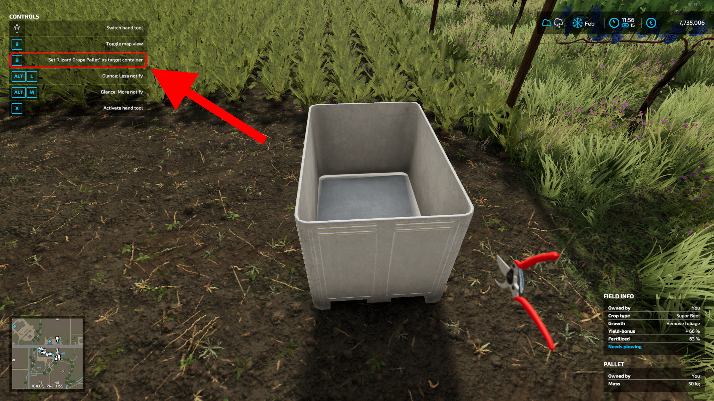
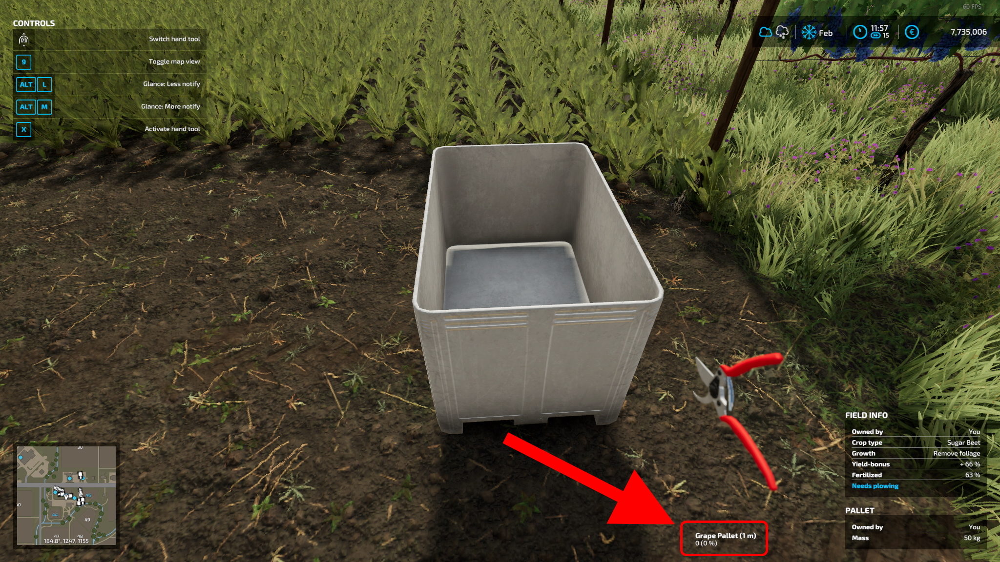
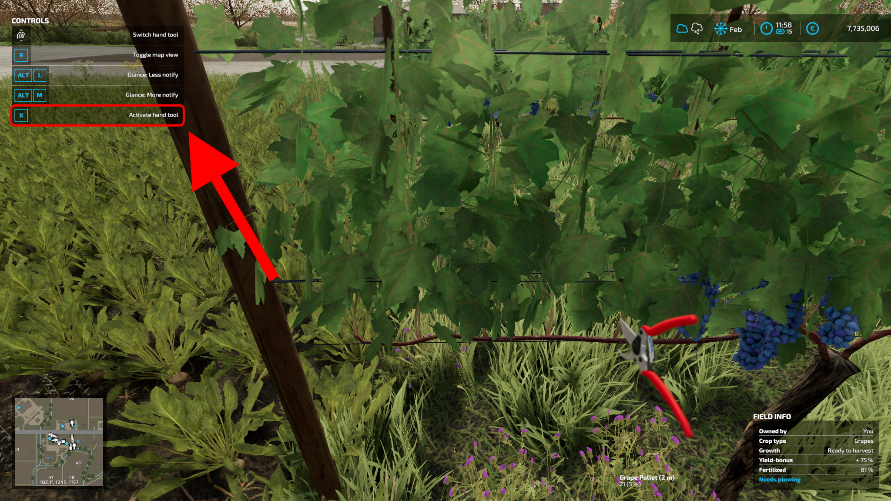

# Vine Hand-Harvest Mod

### [[DEUTSCHE BESCHREIBUNG: HIER KLICKEN]](./README_DE.md)

## Introduction

With this mod you are able to harvest grapes without having to buy an expensive grape harvesting machine. It adds a vineyard shear to the shop (to be found in Grape Technology) which operates similar to a chainsaw. The shear can be selected by mouse wheel.

There's also a new small Böckmann low loader designed for use with grape pallets. These pallets are also newly added from this mod. They are from the base game - but buyable.

#### [Download latest version HERE](./FS22_VineHarvestHandTool.zip).

## How to operate? (Please read carefully!)

* Firstly, activate the shear via mouse wheel like a chainsaw (after buying it, of course).

* Secondly, you need to select the container/trailer where the grapes should be added when harvesting.

  
  The container (or trailer) needs to support grapes and have free space to be able to be set as target.

* Afterwards, the name of the target with its fill level and distance is displayed at the bottom. 

* Now you can go to the vineyard and harvest grapes with the left mouse button (sometimes only X works, if LMB gets blocked by another input binding). You need to release and repress the button to harvest again (harvesting per hand needs to be more effort than just driving a big, expensive machine ;) )
  

* Take care to stay within __8 metres__ of the container/trailer. As the grapes are virtually carried there, it's only possible in a limited area. If you exceed the distance, you will lose "connection" to the target and need to reselect.

## Known issues

As this mod is still in development, there can be errors or malfunctions.

__Currently known issues:__

* Multiplayer is not working perfectly (Harvesting takes some time - hold key a bit longer)

