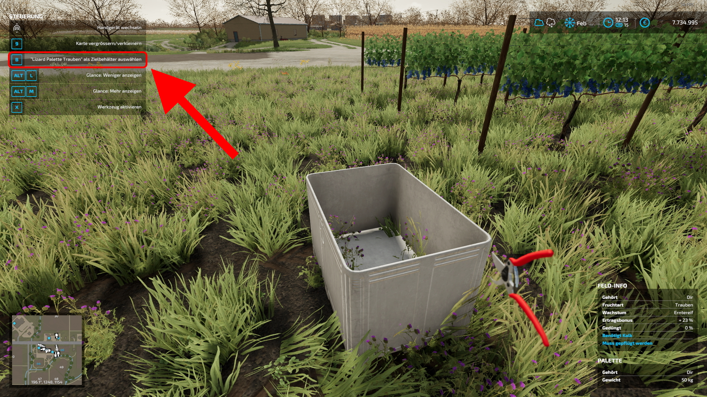
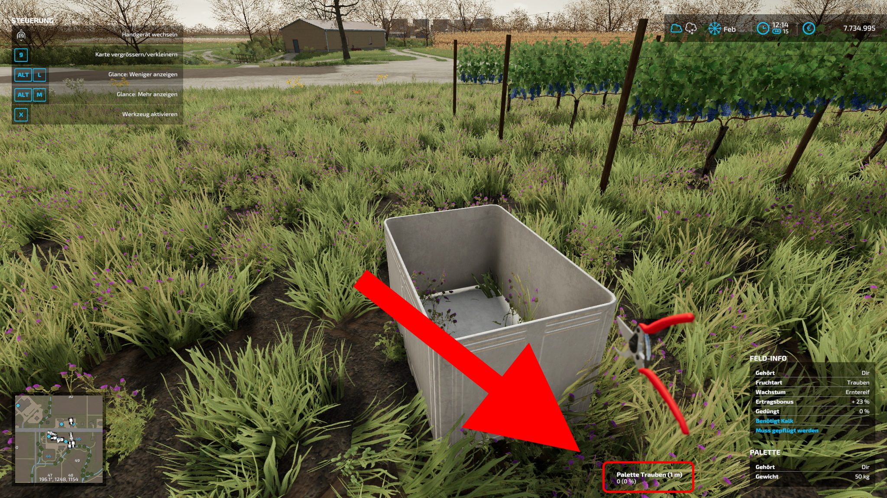
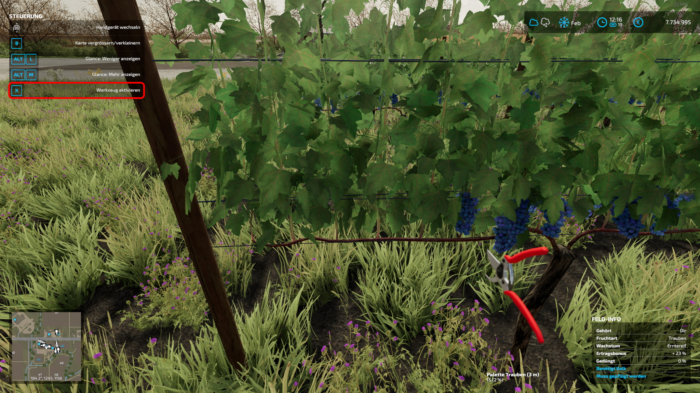

# Wein-Handlese-Mod

## Einführung in den Mod

Dieser Mod fügt die Möglichkeit hinzu, Trauben per Hand zu ernten, ohne den teuren Ernter kaufen zu müssen. Es wird hierfür eine Weingartenschere in den Shop hinzugefügt (zu finden unter Traubentechnik), die ähnlich funktioniert wie eine Kettensäge. Sie kann mit dem Mausrad ausgewählt werden.

Ebenfalls hinzugefügt werden ein schmaler Böckmann Tieflader, der sich für den Transport von Trauben-Paletten eignet, sowie kaufbare Traubenpaletten. Die Traubenpaletten kommen dabei aus dem Grundspiel - sie wurden nur kaufbar gemacht.

#### [Neueste Version HIER herunterladen](./FS22_VineHarvestHandTool.zip).

## Wie wird die Schere bedient? (Bitte VOLLSTÄNDIG lesen!)

* Zuerst muss die Weingartenschere wie eine Kettensäge aktiviert werden

* Anschließend muss der Behälter/Anhänger ausgewählt werden, wo die gepflückten Trauben hinzugefügt werden sollen 
  Der Behälter (bzw. Anhänger) muss Trauben unterstützen und freie Kapazität haben, ansonsten wird die Option nicht angezeigt.
* Hat dies funktioniert, wird der Name des Behälters mit dessen Füllstand und Entfernung rechts unten angezeigt:
  

* Nun kann man zu den Weinreben gehen und diese per Linksklick (manchmal auch per X, falls die linke Maustaste von einem anderen Inputbinding blockiert wird) ernten. Man muss für jedes Stück die Taste loslassen und erneut drücken, um das Ernten nicht zu einfach zu machen (schließlich spart man sich einiges an Geld für den großen Vollernter).
  

* Achtet darauf, innerhalb von __8 Meter__ des Behälters zu bleiben. Da die Trauben quasi dorthin getragen werden, ist das Ernten nur in beschränktem Umkreis möglich. Wird der Radius überschritten geht die "Verbindung" verloren und man muss den Behälter neu auswählen.

## Probleme, Fehler, etc

Da der Mod noch in Beta-Status ist, können noch __Fehler oder Fehlfunktionen__ auftreten.

__Aktuelle bekannte Fehler:__

* Multiplayer funktioniert grenzwertig (Ernten dauert etwas länger - Taste gedrückt halten)

